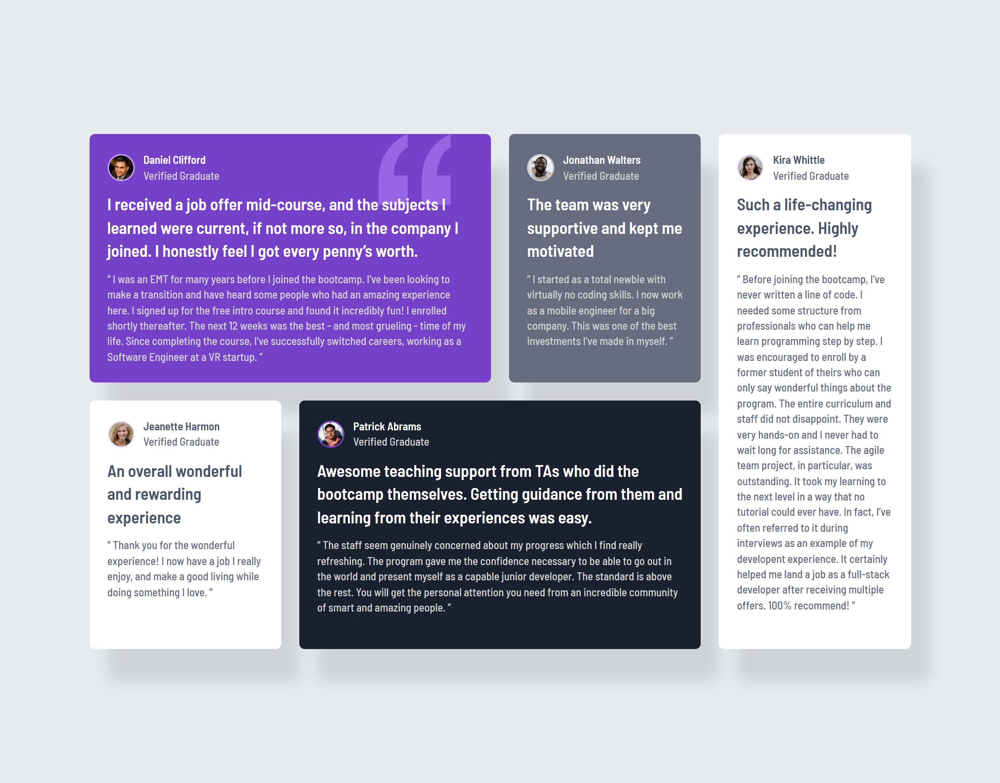

# Testimonials Grid Section

This is a solution to the [Testimonials grid section challenge on Frontend Mentor](https://www.frontendmentor.io/challenges/testimonials-grid-section-Nnw6J7Un7). Frontend Mentor challenges help you improve your coding skills by building realistic projects.

## The challenge

Users should be able to:

- View the optimal layout for the site depending on their device's screen size

## Screenshot

## Built with

- Semantic HTML5 markup
- CSS custom properties
- Flexbox
- CSS Grid
- Mobile-first workflow

## Links

- Solution URL: [https://www.frontendmentor.io/solutions/responsive-testimonials-grid-with-css-customized-cards-l5T4woOxaK](https://www.frontendmentor.io/solutions/responsive-testimonials-grid-with-css-customized-cards-l5T4woOxaK)

- Live Site URL: [https://codereme.github.io/testimonials-grid-section](https://codereme.github.io/testimonials-grid-section)

## Author

- Frontend Mentor - [@codereme](https://www.frontendmentor.io/profile/codereme)
- Github - [@codereme](https://github.com/codereme)
